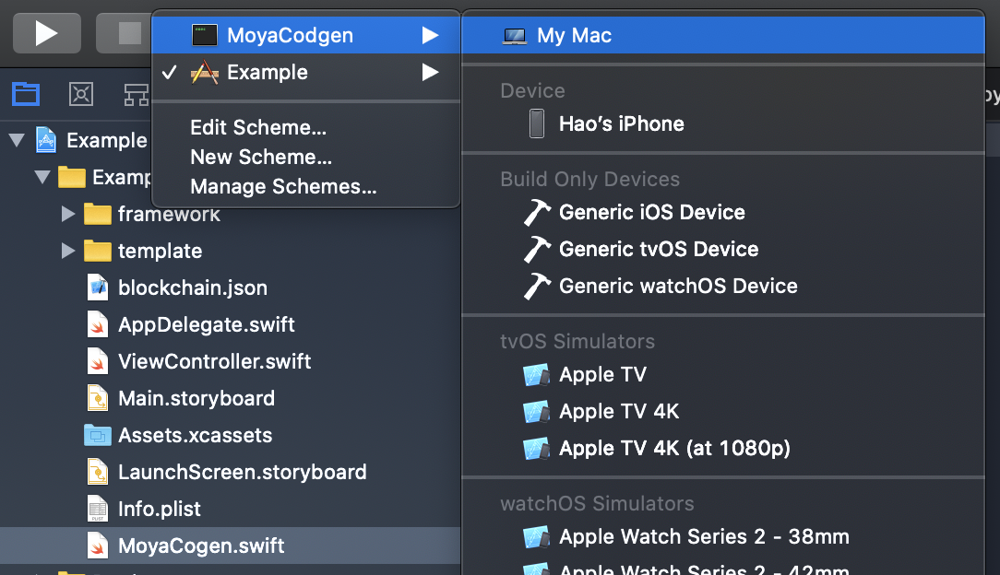
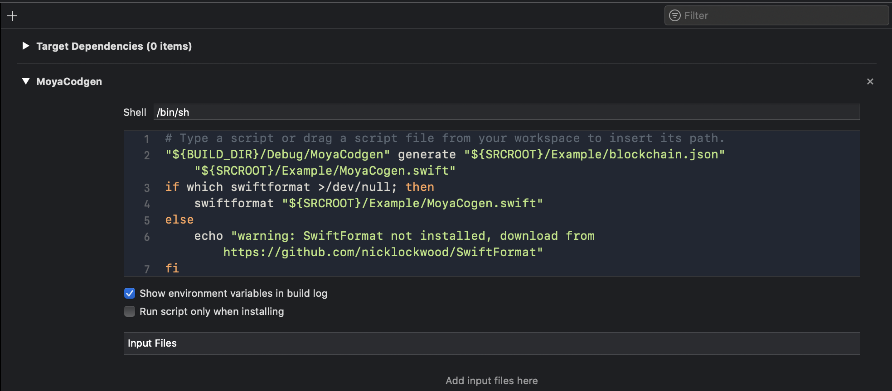

# MoyaCodgen

MoyaCodgen is a swift generator using **[Stencil](https://github.com/stencilproject/Stencil)** template to generate network requesting code for **[Moya](https://github.com/Moya/Moya)** framework. The input of th framework is a json file, the rule will be added later.

## How to run
1. Install denpencies, 
```
swift package update
swift package generate-xcodeproj
open MoyaCodgenExample.xcworkspace
```

2. Run the **`MoyaCodgen`** command firstly in Xcode:


3. Run the **`Example`** App in Xcode

4. Check the `MoyaCodgen.swift` file

## TODO

- [ ] Cocaopod support
- [ ] More Moya medthod support
- [ ] Format generate code
- [ ] Avoid override file

## Optional *
To generate a better code result, I highlt recommand you to install [SwiftFormat](https://github.com/nicklockwood/SwiftFormat).
```shell
brew install swiftformat
```
It will format the generate code


## Example

**Input**
```json
{
    "name": "Waves",
    "baseURL": "https://waves-url.com",
    "interfaces": [
        {
            "name": "balance",
            "method": "get",
            "path": "/addresses/balance/\\(address)/0",
            "parameters": [
                {
                    "name": "address",
                    "type": "String",
                    "inPath": true
                }
            ]
        }
      ],
      "models": [
        {
            "name": "WavesBalance",
            "attributes": [
                {
                    "name": "balance",
                    "type": "Int64"
                }
            ]
        }
      ]
  }
```

**Output**
- WavesMoya.swift
```swift

enum WavesRPC {
    case balance(String)
}

extension WavesRPC: TargetType {
    var baseURL: URL {
        return URL(string:"https://waves-url.com")!
    }

    var path: String {
        switch self {
        case .balance(let address):
            return "/addresses/balance/\(address)/0"
        }
    }

    var method: Moya.Method {
        switch self {
        case .balance:
            return .get
        }
    }

    var sampleData: Data {
        return Data()
    }

    var task: Task {
        switch self {
        case .balance(_):
            return .requestPlain
        }
    }

    var headers: [String: String]? {
        return [
            "content-type": "application/json",
        ]
    }
}
```

- WavesModel.swift
```swift
import Foundation

struct WavesBalance: Codable {
    let balance: Int64
}
```

